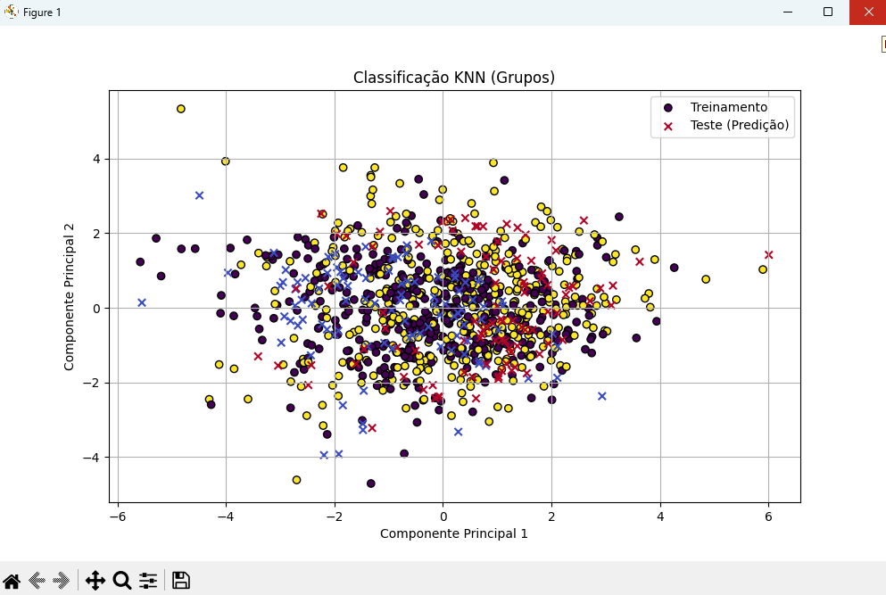
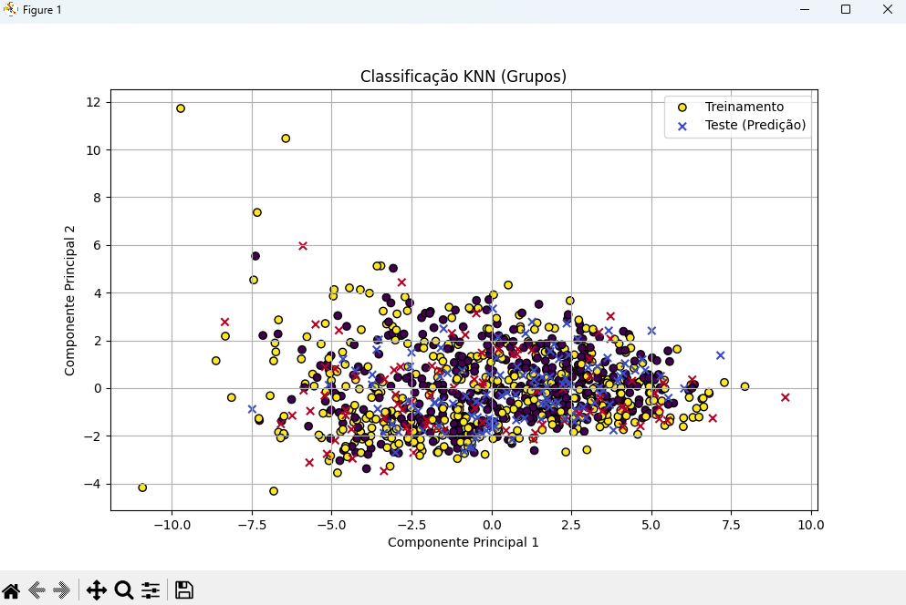
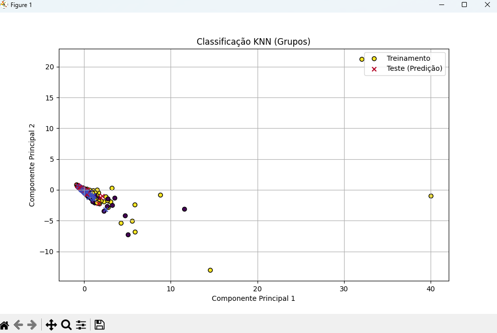
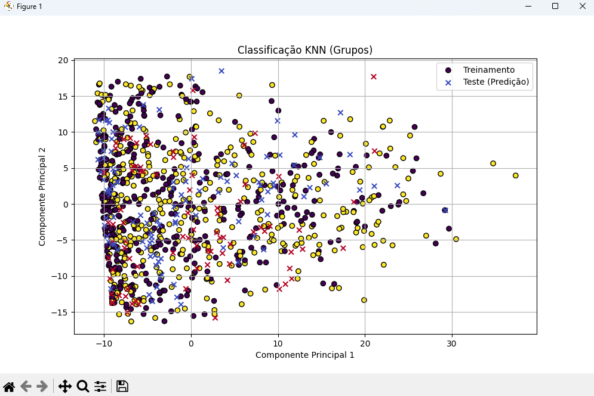

# Descrição do Projeto

Este projeto visa a classificação de imagens de gatos e cachorros usando o algoritmo K-Nearest Neighbors (KNN) e técnicas de extração de características. Abaixo estão descritos os algoritmos escolhidos, como foram implementados e os resultados obtidos.
# Base de dados
A base de dados utilizada foi a seguinte: https://www.kaggle.com/datasets/anthonytherrien/dog-vs-cat, ela contém figuras de gatos e cachorros feitos por inteligencia artificial.
# Processos e Algoritmos Utilizados

  # 1. Extração de Características
  A extração de características é uma etapa crucial na classificação de imagens. Usamos a classe FeatureExtractor para extrair diferentes tipos de características das imagens.
  ## a. Momentos Simples
  Os Momentos Simples são estatísticas calculadas a partir da imagem em escala de cinza. Incluem:  
  * Média: A média dos valores dos pixels.
  * Variância: A medida da dispersão dos valores dos pixels em relação à média.    
  * Desvio Padrão: A raiz quadrada da variância.
  * Skewness (Assimetria): Medida da assimetria da distribuição dos pixels.
  * Curtose: Medida da "altitude" da distribuição dos pixels.    
  ## b. Momentos Geométricos
  Os Momentos Geométricos são calculados usando a imagem binarizada e fornecem informações sobre a forma da imagem. Incluem:
  - Momentos Geométricos: Medidas estatísticas da forma da imagem binarizada.
  - Momentos Hu: Uma série de invariantes que descrevem a forma da imagem. 
  ## c. Local Binary Pattern (LBP)
  LBP é uma técnica de textura que captura padrões locais na imagem.      
   ## d. Canny Edge Detector
  O detector de bordas de Canny é usado para detectar bordas na imagem e extrair um vetor de características baseado nas bordas detectadas.
  ## e. Histogramas
  Histogramas são vetores da frequencia da intensidade de cada pixel na imagem
  
  
  
  # 2. Algoritmo de Classificação
  K-Nearest Neighbors (KNN)
  O KNN é um algoritmo de aprendizado supervisionado que classifica uma amostra com base na maioria dos votos de seus vizinhos mais próximos.

  - Escolha do Número de Vizinhos: Testamos diferentes valores para n_neighbors e escolhemos o que apresentou a melhor acurácia.
    
   A escolha do número de vizinhos no KNN impactou significativamente a performance do modelo. A visualização dos resultados ajudou a entender melhor a distribuição das predições.

# 3. Visualização dos Resultados

Utilizamos o PCA (Análise de Componentes Principais) para reduzir a dimensionalidade dos dados e visualizá-los em um gráfico 2D, facilitando a análise das predições do modelo.

# Resultados
A acurácia dos diferentes tipos de características foi comparada, e os resultados foram visualizados em um gráfico de barras.

A seguir são apresentados a formação dos graficos do KNN aplicados em cada algoritmo de classificação
## Momentos Simples

## Momento Geometrico

## Momentos HU

## Histogramas
### Canal vermelho

### Canal verde

### Canal azul

## Local Binary Pattern (LBP)

## Canny

## Video
https://github.com/user-attachments/assets/f4468c0a-d4b3-4b78-a935-84c6ec638720

